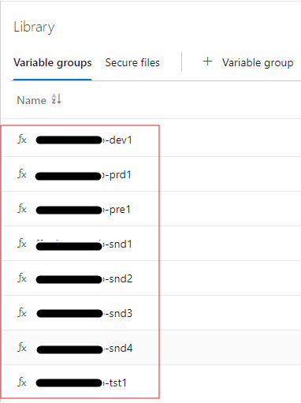
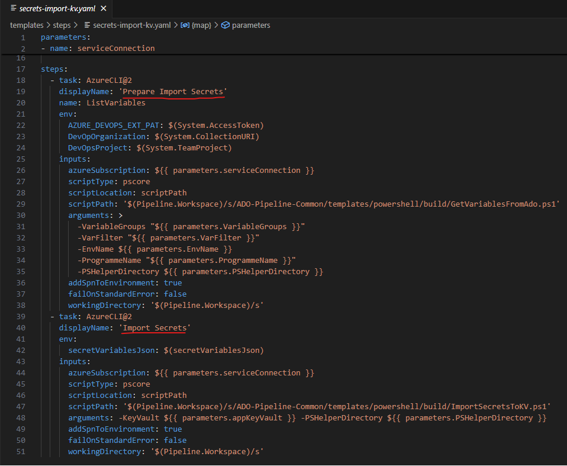
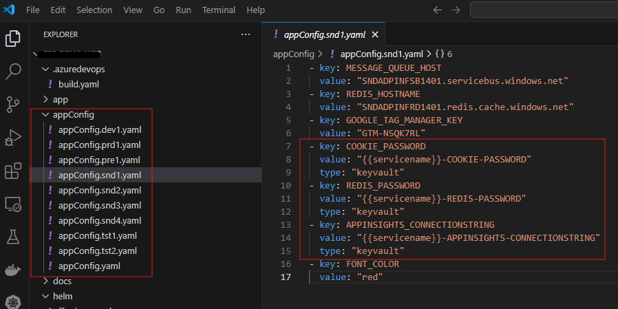

**ADP Services Secret Management**

The secrets in ADP services are managed using Azure Key Vault. The secretes for each individual services are imported to the Azure Key Vault through ADO Pipeline tasks and are accessed by the services by using the application configuration YAML files. The importing of secretes to the Key Vault and referencing them by individual services are automated using ADO Pipelines. The detailed workflow for secret management includes the following steps:

**1. Configure ADO Library**

- Create variable groups for each environments of the service in ADO Library.

  Naming Convection: It follows the following convention for creating the variable groups for a service.

        {service name}-{env}

-   Example: The variable groups for different environment of the service **ffc-demo-web** are shown below.

  

- Add the variables and the values for the secretes in each of the variable groups.

  Variable Naming Convection: It follows the following convention for creating the variables in variable groups.

        {service name}-{variable name}

- Example: Secrete variables for the service **ffc-demo-web** are shown below.

  

**2. ADO Pipeline - Import secrets to Key Vault**

The variables and values from the variable groups are automated to import to the Azure Key Vault using 
Pipeline task and Power Shell scripts. 

- Repo: ADO-PIPELINE-COMMON  

- Example: The code snippet involved in importing the secrets to the Azure Key Vault is 
  shown below.

  

**3. Azure Key Vault - Imported secretes**

After the secretes are added to the ADO Library variable groups and the service CI pipeline run successfully would import the secrets to the Key Vault as shown below. 

- Example: Secretes imported to the Key Vault for the service **ffc-demo-web** are shown below

  
 

**4. App Config**

Access the secrets from the Key Vault through appConfig YAML files included in each of the services. 
There are two different kinds of appConfig files. 

- Environment specific appConfig file: Each service has it own environment specific appConfig file to access it 
  respective secrets from the Key Vault.

  File Naming Convection:

      appConfig.{environment}.yaml

- Common appConfig file: There is a common appConfig.yaml file included in each of the service that defines the 
  environment variables that commonly used by all of the service environments.

- Example: The appConfig files for different environments for the service **ffc-demo-web** are shown below.

  

The type of the variable (key) that reference the secretes form the Key Vault should be defined as **type: "keyvault"** in the config YAML file.

**4. ADO Pipeline - Import App Config**

The Pipeline tasks shown below use the environment specific appConfig YAML files to import the secrets from Azure Key Vault to the service.

- Repo: ADO-PIPELINE-COMMON  

**5. Run Pipeline - appConfig only**

The secretes can be added to the Key Vault and also referenced by the service using the appConfig files. This can be achieved by running the pipeline on selecting the **Deploy App Config** check box. This helps in running only the secrete management tasks instated of running all the tasks in the pipeline. This is useful when updating the secretes of a service.

