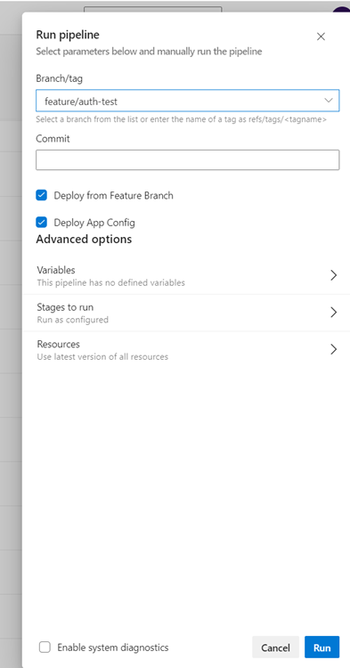
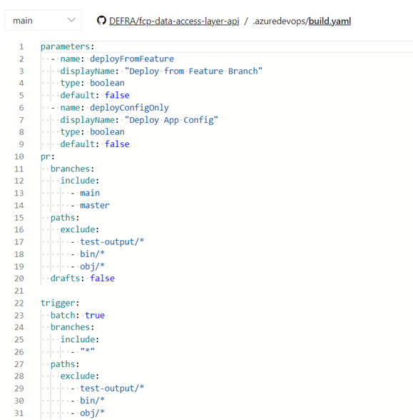
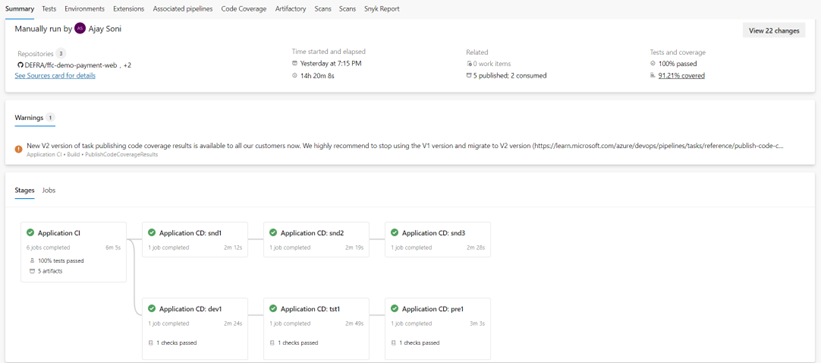

# How to deploy a Platform Service

In this how to guide you will learn how to build, deploy, and monitor a Platform service (Web App, User Interface, API etc) for your team. It includes information about Pipelines specifically and how the ADP Backstage Portal supports this.

## Prerequisites
Before building and deploying a service, you will first need to ensure that:

- [Onboarded delivery project on to ADP](../Getting-Started/onboarding-a-delivery-project.md)
- [Created a Platform Service for your team/delivery project](../How-to-guides/how-to-create-a-platform-service.md)

## Overview

By completing this guide, you will have completed these actions:

- [x] Learned how to build and run a CI pipeline for your service.
- [X] Learned how to deploy your platform service to an environment.
- [X] Learned how to monitor your platform service, and check the status of it
- [X] Understand how ADP uses Azure DevOps Pipelines for builds and deployments.
- [X] How to customize your pipeline to your needs and where you can find it.
- [X] How the ADP Portal supports you

## Guide

### How do I find my service’s CI/CD pipeline?

All pipelines in ADP are created in your projects/programmes Azure DevOps project. This is specific to your team. It’s the one you chose on your scaffolder creation of a service. We use YAML [Azure Pipelines](https://azure.microsoft.com/en-gb/products/devops/pipelines) and [Defra GitHub](https://github.com/DEFRA) to store all code. 
Pipelines are mapped 1-1 per microservice, and can deploy the Web App, Infra, App Configuration and Database schema together as an immutable unit.

**In your scaffolded repository:**

- Once you have [scaffolded your project/service](https://defra.github.io/adp-documentation/How-to-guides/how-to-create-a-platform-service/), you will have a ‘[build.yaml](https://github.com/DEFRA/ffc-demo-web/tree/main/.azuredevops)’ in an .azureDevOps folder in your microservice repository in GitHub. This is your pipeline instantiation.
In your chosen Azure DevOps project:
- On the Pipelines page, either at the root level or under a Pipelines Folder name you defined/chose, you will find your Pipeline.
- Your pipeline is convention based including naming. Your pipeline will be called the same name as your repository: `<your-service-name>`. 
  - E.g: `<projectcode>-<servicename>-api`
  

Above image an example of a Pipeline scaffolded called ‘**adp-demo99**’ in the **DEMO** folder.

**Can I find this in the ADP Portal?**

Yes! Simply go to your components page that you scaffolded/created via the ADP Portal, and click on the CI/CD tab, which will give you information on your pipeline, and will link off to the exact location.

### How do I run my service pipelines?
We promote continuous integration (CI) and continuous delivery (CD). Your pipeline will trigger (run the CI build) automatically on any change to the ‘main’ branch, or any feature branch you create and anytime you check-in. This includes PR branches. You simply run your pipeline from the ADO Pipelines interface by clicking ‘Run pipeline’.

You can:

- Just run a CI build on check-in on feature branches – __default approach.__
- Run a CI build and an automatic deployment into Sandpit/Dev from a feature branch.
- Run a CI from the main branch and promote your code from development to production.
- Customise your CI, PR and build triggers, deploy configuration only or the full app, in your services ‘build.yaml’.
- Run your pipeline manually/on-demand, by selecting ‘Run pipeline’ blue-button on the top-right hand corner of your Azure Pipelines project page.
  - You can select any feature and main branches and customise any flags for deployment.
  - You can run from Commit ID and from GitHub Release Tag.
  - You can override variables if required.

### Are there any requirements for my CI pipeline to run?

- You must update your App Version using sematic versioning, at least once.
  - This is an update in your ‘package.json’ or your .’csproj’ file to the Major, Minor or Patch.
- You must be building a NodeJs or C# app that is containerised with a HELM Chart.

Pipeline documentation and parameters and configuration options [can be found here](https://github.com/DEFRA/ado-pipeline-common/blob/main/docs/AppBuildAndDeploy.md#usage).

 
Above image of pipeline run example. 

### How do I customise my CI/CD pipelines?
You can change some basic functionality of your pipeline. A lot of it is defined for you in a convention-based manner, including the running of unit tests, reporting, environments that are available etc, and some are selectable, such as build of .NET or NodeJS apps, location of test files, PR and CI triggers, and the parameters to deploy configuration only or automatic deploy on every feature build. 
Full details can be found on the Pipelines documentation GitHub page.

Above image is an example of what can be changed in terms of Pipeline Parameters (triggers, deployment types, paths to include/exclude).
The below image is an example of what can be changed. You can change things like your config locations, test paths, what ADO Secret variable groups you wish to import, what App Framework (Node or C#) etc.

### What does my progression look like through environments?
To promote your code through environments, you can use the Azure Pipelines user interface for your team/project to either:

- Allow automated progression via automated checks or and continuous delivery or,
- Manually push/promote the code to environments on demand.

**Your environments and any default gates or checks will be automatically plotted for you. This is an example of a full pipeline run. You can select, based on the Platform route-to-live documentation, which environments you promote code to. You don’t need to go to all environments to go live.**
 

This is an example of a waiting ‘stage’ which is an environment:
 

To promote code, you can select ‘Review’ in the top-right hand corner and click **approve**.

[Full Azure Pipelines documentation can be found here.](https://learn.microsoft.com/en-us/azure/devops/pipelines/get-started/pipelines-get-started?view=azure-devops)

### What ways can I monitor my pipelines and service, and the steps that are run?

Every pipeline run includes steps such as unit tests, integration tests, acceptance tests, app builds, code linting, static code analysis including Sonar Cloud, OWASP checks, performance testing capability, container/app scanning with Snyk etc. 

We report out metrics in Azure DevOps Pipelines user interface for your project and service, for things like Unit Test coverage, test passes and failures, and any step failures. Full details are covered in Pipelines documentation. Details can also be found in your projects Snyk or Sonar Cloud report.

From the [ADP Backstage Portal](https://portal.adp.defra.gov.uk/), you can find the following information for all environments:

- Deployments and HELM release status, including app versions and which environments.
- Services deployed into AKS (Kubernetes) and their health status and stats.
- Any health status codes, errors, and issues
- Any log outputs for running services, including any errors.
- Last reconciliation (deployment) date and time via FluxCD, and any successes or failures
- Debug and log information
- Overview of Pipeline runs in ADO.
- Pull Requests open/closed etc.
- Access to Grafana and Dashboards, to monitor and maintain your service:
  - Includes Prometheus logs, status, errors, consumption etc.
- Any service documentation for your app
- Any dependencies for your apps, and how it links to other projects, programmes, and services.
- Any API specifications (Open API) and associated components
- Key links for your service – GitHub, ADO, Snyk, Sonar Cloud, Azure Portal, Dashboards, your Service’s frontend URL etc.

The portal is fully self-service. And each component deployed details the above. You should use the ADP Portal to monitor, manage and view data about your service if it isn’t included in your Pipeline run.