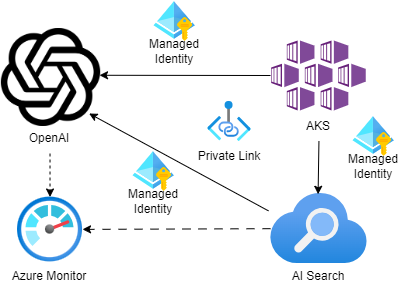

!!! note "TODO"
    This page is a work in progress and will be updated in due course.


# Azure AI Services

This article details the AI Services Architecture for the solution at a high level.

AI Services supported by ADP:

- [Azure Open AI Service](#azure-open-ai)
- [Azure AI Search](#azure-ai-search)

!!! warning

    Please ensure you fellow DEFRA's guidelines and policies when using AI services. This includes the use of data and the use of AI services in general in order to ensure your delivery project is using AI responsibly.

## Azure Open AI
{ align=left width="150" }Azure OpenAI Service provides REST API access to OpenAI's powerful language models including the GPT-4, GPT-4 Turbo with Vision, GPT-3.5-Turbo, and Embeddings model series. In addition, the new GPT-4 and GPT-3.5-Turbo model series have now reached general availability. These models can be easily adapted to your specific task including but not limited to content generation, summarization, image understanding, semantic search, and natural language to code translation.

### Deployed & Supported Models

For supported models within Azure Open AI, ADP is restricted to the models supported by Azure in the [UK South region](https://learn.microsoft.com/en-us/azure/ai-services/openai/concepts/models). The models that are supported are:

| Model | Deployment | Quota | Description |
|-------|------------|-------|-------------|
| gpt-4 | gpt-4 | 80k | Improvement on GPT-3.5 and can understand and generate natural language and code. |
| gpt-35-turbo | gpt-35-turbo | 350k | Improvement on GPT-3 and can understand and generate natural language and code. |
| text-embedding-ada-002 | text-embedding-ada-002 | 350k | Can convert text into numerical vector form to facilitate text similarity. |
|text-embedding-3-large | text-embedding-3-large | 350k | Can convert text into numerical vector form to facilitate text similarity. the This is the latest and most capable embedding model. Upgrading between embeddings models is not possible  |

!!! warning

    Delivery Projects need to be a ware of quota restrictions of the models per subscription/ region as these models are shared between Delivery Projects. ADP can request more quota if required but this will require the approval from Microsoft.

### Architecture


With in the ADP Platform, Azure Open AI Services are deployed with an Azure API Management (APIM) to provide a secure and scalable API endpoint for the AI services. The APIM is used to manage the API lifecycle, provide security, and monitor the API usage. The APIM is deployed in a Subnet (/29) and uses a private link to connect to the Azure OpenAI service. The APIM is deployed with a developer portal to provide a self-service API documentation for the AI services. Between the delivery projects service and the APIM, private link will be implemented and the APIM will use the services' [managed identity](https://learn.microsoft.com/en-us/azure/api-management/api-management-authenticate-authorize-azure-openai#authenticate-with-managed-identity) with the role of `Cognitive Services OpenAI User` assigned. This will allow the APIM to access the AI services on behalf of the delivery project's service privately and securely.

Any other Azure services that need to access the AI services will need to use the APIM endpoint and managed identity as well.

#### Iterative Deployment



In order to meet the time lines and requirements of the delivery projects, we will first only deploy the Azure OpenAI Service and give the AKS cluster and Azure AI Search direct access to the service over a private endpoint with the role of `Cognitive Services OpenAI User`.

This will allow the delivery projects to start using the AI services and provide feedback on the service. Once the APIM is deployed, we will migrate the AI services to APIM to provide a secure and scalable API endpoint for the AI services. 

!!! note
    
    For local development, the delivery projects can use the Azure Open AI services directly in SND only and connected to the DEFRA VPN or DEFRA laptop. This will allow the delivery projects to test the AI services and provide feedback on the service.

#### Developer Access

For local development, developers will be able to access SND only via the DEFRA VPN or DEFRA laptop with the assigned role of `Cognitive Services OpenAI User`. Giving the developers the ability to test Azure Open AI services locally via APIM and view model deployments of the deployment Azure Open AI service.

For Dev plus environments, developers will be able to access SND only via the DEFRA VPN or DEFRA laptop with the assigned role of `Cognitive Services OpenAI User`. This will currently allow them to:

- View the resource in Azure Portal
- View the resource endpoint under “Keys and Endpoint” but not the keys.
- View the resource and associated model deployments in Azure OpenAI Studio
- View what models are available for deployment in Azure OpenAI Studio
- Use the Chat, Completions, and DALL-E (preview) playground experiences with any models that have already been deployed to this Azure OpenAI resource.

!!! note

    Dev plus environments, APIM endpoints will not be exposed to local developer access and will only remain accessible to ADP Azure services or authenticated Delivery project's services only.

#### Monitoring

Uses APIM to increase monitoring of the usage of OpenAI per service you can use an [OpenAI Emit Token Metric policy](https://learn.microsoft.com/en-us/azure/api-management/azure-openai-emit-token-metric-policy) to send metrics to Application Insights about consumption of large language model tokens through Azure OpenAI Service APIs. Token count metrics include: Total Tokens, Prompt Tokens, and Completion Tokens with additional dimensions such as the User ID and API ID. Using these metrics, ADP can monitor the usage per service which can be used by the project delivery teams and ADP to infer usage and potentially request more quota if required but also for billing purposes.

For monitoring Azure Open AI directly we enable the [Azure OpenAI Service Diagnostic Logs](https://learn.microsoft.com/en-us/azure/ai-services/openai/how-to/monitoring) to monitor the usage of the AI services directly. This log data will be stored in to Azure Monitor (Log Analytics Workspace) where ADP and the delivery projects will be able to gain insights such as:

- Azure OpenAI Requests: Total number of calls made to the Azure OpenAI API over a period of time.
- Generated Completion Tokens: Number of generated tokens (output) from an Azure OpenAI model.
- Processed Inference Tokens: Number of inference tokens processed by an Azure OpenAI model. Calculated as prompt tokens (input) + generated tokens.

### Quota & Token Management

The Azure Open AI services are shared between delivery projects and have a quota limit per subscription/ region. The quota limit is shared between the delivery projects and can be increased if required. The quota limit is monitored by the ADP team and will be increased if required with the approval from Microsoft.

For the ADPs platforms current needs and requirements, we opting for the pay-as-you-go pricing model for the Azure Open AI services. This will allow the delivery projects to only pay for what they use and not have to worry about being over charged. This does mean that there is a Tokens-per-Minute limit per model for the Azure Open AI services and the delivery projects will need to be aware of this limit when using the AI services.

In order to manage this an ensure efficient use of the Azure Open AI, APIM will provide policy enforcement to manage the quota limit and present an better experience to the delivery projects when the quota limit is reached:

- [Retry policy](https://learn.microsoft.com/en-us/azure/api-management/retry-policy): When the quota limit is reached, the Azure OpenAI will return a 429 status code to the delivery project's service. APIM will implement a retry policy to wait for a certain amount of time before retrying the request to the Azure Open AI service. This will allow the delivery project's service to wait for the quota limit to be reset and then retry the request to the Azure Open AI service.
- [Token limit policy](https://learn.microsoft.com/en-us/azure/api-management/azure-openai-token-limit-policy): By relying on token usage metrics returned from the OpenAI endpoint, the policy can accurately monitor and enforce limits in real time. The policy also enables precalculation of prompt tokens by API Management, minimizing unnecessary requests to the OpenAI backend if the limit is already exceeded.

### Possible Future Enhancements

#### Semantic caching for Azure OpenAI APIs in APIM

[Enable semantic caching of responses to Azure OpenAI API requests](https://learn.microsoft.com/en-us/azure/api-management/azure-openai-enable-semantic-caching) to reduce bandwidth and processing requirements imposed on the backend APIs and lower latency perceived by API consumers. With semantic caching, you can return cached responses for identical prompts and also for prompts that are similar in meaning, even if the text isn't the same.

#### More Azure OpenAI Service Model Deployments

With our current restrictions on the models that can be deployed in the UK South region, we are limited to the models that are supported by Azure. In the future, we will look to expand the models that are supported in the UK South region and provide more models for the delivery projects to use. For example support for Whisper, DALL-E, and GPT-4o models.

#### Reserved Capacity for Azure OpenAI Service

Reserved capacity, or Provisioned Throughput Units (PTU), for Azure OpenAI. The newer offering is PTU-M (Managed), where the backend compute is abstracted away, pooling of resources. Beyond the default TPMs described above, this Azure OpenAI service feature, PTUs, defines the model processing capacity, using reserved resources, for processing prompts and generating completions.

PTUs are purchased as a monthly commitment with an auto-renewal option, which will reserve Azure OpenAI capacity within an Azure subscription, using a specific model, in a specific Azure region. TPM and PTU can be used together to provide scaling within a single region.

PTU minimums are VERY expensive thus requiring ADP to be at a certain scale to justify the cost between its Delivery Projects.

### Key Resources

- [Azure Open AI Service](https://learn.microsoft.com/en-us/azure/ai-services/openai/)
- [GitHub: Microsoft - AzureOpenAI-with-APIM](https://github.com/microsoft/AzureOpenAI-with-APIM)
- [GitHub: aoai-apim](https://github.com/Azure/aoai-apim)
- [Medium: Azure OpenAI Best Practice](https://medium.com/@manoranjan.rajguru/azure-openai-best-practices-for-production-b733eca4bde5)
- [Managed Identity with APIM](https://learn.microsoft.com/en-us/azure/api-management/api-management-howto-use-managed-service-identity)
- [Role-based access control for Azure OpenAI Service](https://learn.microsoft.com/en-us/azure/ai-services/openai/how-to/role-based-access-control)
- [MS Learn: Import Azure Open Open AI Service into APIM](https://learn.microsoft.com/en-us/azure/api-management/azure-openai-api-from-specification)

### Outstanding Questions

- ???

## Azure AI Search

{ align=left } Azure AI Search (formerly known as "Azure Cognitive Search") provides secure information retrieval at scale over user-owned content in traditional and generative AI search applications.

Information retrieval is foundational to any app that surfaces text and vectors. Common scenarios include catalog or document search, data exploration, and increasingly chat-style apps over proprietary grounding data. When you create a search service, you work with the following capabilities:

- A search engine for vector search and full text and hybrid search over a search index
- Rich indexing with integrated data chunking and vectorization (preview), lexical analysis for text, and optional applied AI for content extraction and transformation
- Rich query syntax for vector queries, text search, hybrid queries, fuzzy search, autocomplete, geo-search and others
- Azure scale, security, and reach
- Azure integration at the data layer, machine learning layer, Azure AI services and Azure OpenAI

ADP provides a managed Azure AI Search service for delivery projects to use which is scalable and secure using best practice. The core components (indexes, datastores, etc) of the Azure AI Search will be dependently deployable and can be created by delivery projects as required on a self-service basis.

### Architecture


ADP has selected a [Standard SKU](https://learn.microsoft.com/en-us/azure/search/search-sku) for the Azure AI Search service as it provides a balance of storage and query capacity for the delivery projects which is more cost effective. Azure AI Search is a shared service between the ADP Delivery Projects. Allowing up to 50 indexes and 50 indexers in total and 35 GB of storage per partition and 160 GB of storage with two replicas, requiring two search unit per environment. This will allow 99.9% availability for read operations.

!!! note

    ADP Team can increase the tier, number of search units (replicas and partitions), if required as the need raises. Under the current scope of the current delivery projects, the standard SKU with two search units is sufficient allowing for 99.9% availability for read operations. If a project requires 99.9% availability for read/write operations can additional search units can be added.

Azure AI Search will not be reachable from the public internet and will only be accessible via a private link to DEFRA VPN, DEFRA laptops, or consuming Azure/ Delivery Project services via a private endpoint.

Delivery Project services will be given the role of `Search Index Data Contributor` scoped to the [indexes that the service requires](https://learn.microsoft.com/en-us/azure/search/search-security-rbac?tabs=config-svc-portal%2Croles-portal-admin%2Croles-portal%2Croles-portal-query%2Ctest-portal%2Ccustom-role-portal%2Cdisable-keys-portal#grant-access-to-a-single-index). This will allow the Read-write access to the content of these indexes.

Azure AI Search will need access to Azure Open AI embedding models to allow for semantic search in the search indexes and for use in its skill sets. No direct access to the Azure open AI services will be allowed and will only be accessible via the Azure API Management endpoint. To ensure that Azure AI Search has efficient access, the role of `Cognitive Services OpenAI User` will be assigned to the Azure AI Search service system assigned managed identity. This will allow the Azure AI Search service to access the Azure Open AI services via the APIM endpoint over a private link securely and efficiently.

#### Developer Access

For SND environments, developers will be able to access the Azure AI Search service via the Azure Portal with the assigned role of `Reader` cross the whole of the AI Search service, as well ass the role of `Search Index Data Contributor` scoped to the [indexes that is created for that developers Project Deliveries](https://learn.microsoft.com/en-us/azure/search/search-security-rbac?tabs=config-svc-portal%2Croles-portal-admin%2Croles-portal%2Croles-portal-query%2Ctest-portal%2Ccustom-role-portal%2Cdisable-keys-portal#grant-access-to-a-single-index). This will allow the Read-write access to content of these indexes and also import, refresh, or query the documents collection of an index. Allow for local development and testing of the Azure AI Search service.

For Dev plus environments, developers will be able to access the Azure AI Search service via the Azure Portal with the assigned role of `Reader`. This will currently allow them to read across the entire service, including search metrics, content metrics (storage consumed, number of objects), and the object definitions of data plane resources (indexes, indexers, and so on). However, they can't read API keys or read content within indexes ensuring the data control plane is secure.

Developers in all environments will be able to access Azure AI Search only via DEFRA VPN or DEFRA laptop with restrictions that are detailed above.

#### Monitoring

!!! note

    Azure AI Search doesn't monitor individual user access to content on the search service. If you require this level of monitoring, you need to implement it in your client application.

The [diagnostic logs for Azure AI Search](https://learn.microsoft.com/en-us/azure/search/monitor-azure-cognitive-search) are stored in Azure Monitor (Log Analytics Workspace) where ADP and the delivery projects will be able to gain insights such as: latency, errors, and usage of the search service.

### Deployment of Azure AI Search

Azure AI Search service will only be deployed as a common service for use by any of Delivery Projects. For self service creation and updating of the Azure AI Search Components, developers will be able to use ADP powershell scripts and JSON definition file to create these components with X repository which will ensure that the components are created in a consistent manner across all projects and environments using Azure Pipelines.

#### Token replacement

????

```json
{
  "name": "MyDataSource",
  "description": "Example of a data source that uses a connection string with a token",
  "type": "sharepoint",
  "subtype": null,
  "credentials": {
    "connectionString": "#{MyDataSourceConnectionString}#"
  },
  "container": {
    "name": "useQuery",
    "query": "includeLibrary=...."
  },
  "dataChangeDetectionPolicy": null,
  "dataDeletionDetectionPolicy": null,
  "encryptionKey": null,
  "identity": null
}
```

### Possible Future Enhancements

- TBC

### Key Resources

- [Secure your Azure Cognitive Search indexes and queries with Azure AD](https://techcommunity.microsoft.com/t5/ai-azure-ai-services-blog/secure-your-azure-cognitive-search-indexes-and-queries-with/ba-p/2973033)
- [Create a private endpoint for a secure connection to Azure AI Search](https://learn.microsoft.com/en-us/azure/search/service-create-private-endpoint)
- [Azure AI Search with skill sets](https://learn.microsoft.com/en-us/azure/architecture/solution-ideas/articles/cognitive-search-with-skillsets)

### Outstanding Questions

- Where is the best place for the deployment scripts for Azure AI Search components? Very unsure of how is best to make this self-service for the delivery projects.
- What data source to support?
- What skillsets to support? Custom skillsets?